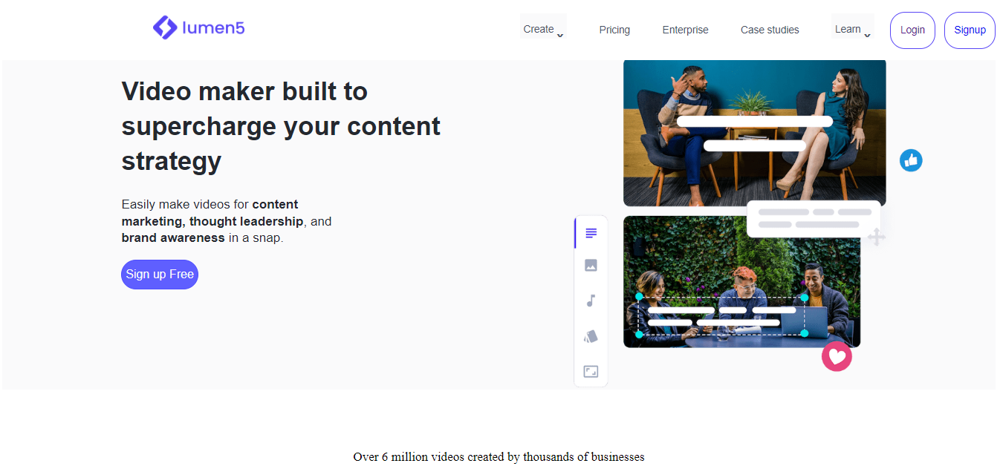
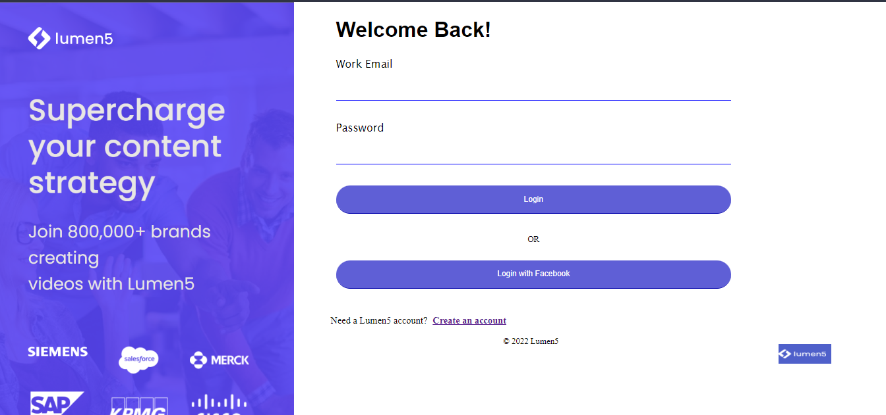
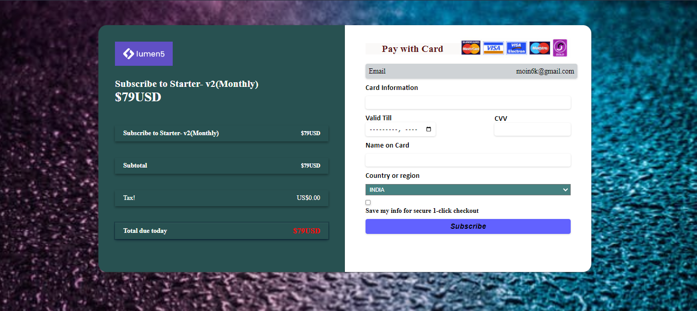

<h1>Lumen5.com-Clone</h1>

Clone of Lumen5

Position: Team Leader

Duration: 5 days 

Responsibilities: Managed team | Managed Git Repository | Pricing Page 

<h1>Team Members</h1>

1: Moin Khan

2: Shivam Moudgil

3: Arun Prasad

4: Ujjwal Joshi

5: Shubham Kumar

<h1>Tech Stack Used</h1>

Javascript | Css | Html | Bootstrap

Lumen5 is a video creation platform designed for brands and businesses to produce engaging video content for social posts, stories, and ads. We have made this clone in 5 days. It was team collaborative project in which I got a chance to lead the team. I lead the 5 member team.

<h2>Checkout Our Clone Website</h2>
<a href = "https://lumen5project2.netlify.app/" >Go Live</a>

<h2>Home Page<h2>

<h2>Pricing Page</h2>

  
<h2>Login Page<h2>

  
  <h2>Payment Page</h2>
  
